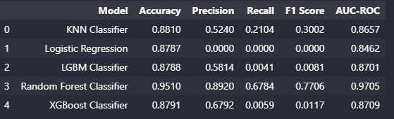

# The Insurance Propensity Score

## Business Problem

The insurance company wants to predict whether the previous year's health insurance customers will express interest in the new product, Auto Insurance. 
Using data from 380,000 customers, the objective is to create a model that classifies customers in decreasing order of probability of purchasing the product. 
This will help the sales team prioritize those most likely, optimizing the campaign. Key insights include relevant attributes, reach of 20,000 calls, and expanded capacity of 40,000 calls. 
In Kaggle data, each row is a customer with attributes and survey response about the new product.

## The Solution Strategy

Develop a machine learning model with 90% accuracy to detect customers most likely to purchase auto insurance.

**Step 01. BUSINESS UNDERSTANDING** : Acquire in-depth knowledge about the company requesting the solution and the sector in which it operates.

**Step 02. BUSINESS PROBLEM** : Clearly and precisely defines the problem or challenge that data analysis aims to solve within the business context.

**Step 03. DATA COLLECTION** : Obtain from relevant datasets required for the DS project.

**Step 04. DATA DRESCRIPTION** : Use statistics metrics to identify data distribuctions.

**Step 05. DATA CLEANING AND PRE-PREPARATION** : Transformation and enhancement of the raw data obtained to make it suitable for analysis and modeling.

**Step 06. EXPLORATORY DATA ANALYSIS (EDA)** : Explore data to find insights and the features that better describe the fenomonous.

**Step 07. DATA MODELING** : Essential step to structure and provide relevant info for effective learning algorithms.

**Step 08. TRAINING OF MACHINE LEARNING ALGORITHMS** : Machine Learning Model Trainning.

**Step 09. FINE TUNING** : Find the best values of each parameter of the select Model.

**Step 10. TRANSLATION AND INTERPRETATION OF THE ERROR FOR THE BUSINESS TEAM** : Convert the performance of the Machine Learning model into a business result.

**Step 11. DEPLOY MODEL TO PRODUCTION** : Deploying the machine learning model in a production environment, where it can be accessed by other people, systems, and applications.

## The Dataset

The dataset is available on kaggle plataform ([https://www.kaggle.com/c/rossmann-store-sales/data](https://www.kaggle.com/datasets/anmolkumar/health-insurance-cross-sell-prediction)).

## Top Data Insights 

1. **Overall Model Performance**:
   - Accuracy: 95.10%
   - Balanced Accuracy: 83.35%
   - Kappa Index: 0.74
   - Accuracy: 89.20%
   - Recall: 67.84%
   - F1 Score: 0.77
   - Matthews Correlation Coefficient: 0.75

2. **Ranking Metrics**:
   - ROC AUC: 83.35%
   - Top K Score: 95.10%

3. **Model Behavior**:
   - Tendency to conservative forecasts, underestimating more than overestimating.

4. **Customer Insights**:
   - Customers aged 30 to 50 show more interest in vehicle insurance.
   - Customers with newer cars are more interested.
   - Interest varies by region.
   - Key attributes: previouslyInsured, annualPremium, vintage, age, regionCode, policySalesChannel, vehicleDamage.

## Machine Learning Models

I used in this step the models:
* KNN Classifier
* Logistic Regression
* LGBM Classifier
* Random Forest Classifier
* XGBoost Classifier

## Models Performance

The Random Forest Classifier performed well, with an accuracy of 95% in predicting the customers most likely to purchase auto insurance.

## Convert Model Performance to Business Values
**Estimated Revenue**:
   - Using the model, an additional revenue of approximately 12,469,399.46 is expected compared to random calls.

The model has good overall performance and is effective in identifying customers likely to purchase car insurance. Targeting calls based on the template will result in significantly higher revenue than random approaches.

## Next Steps:
Next steps include:
+ Continuous monitoring of the model in production.
+ Collection of model usage data for analysis.
+ Regularly evaluate performance and adjust as necessary.
+ Exploration of model optimization opportunities such as:
    - Development of specific models for location.
    - Exploration of additional data and resources to improve forecast accuracy.
    - Continuous refinement of models and adjustments of hyper parameters.
- Scalability consideration to handle an increase in request volume.

Successful deployment of the model is an important milestone, but ongoing maintenance and improvement are essential to ensure the model continues to be a valuable tool for the company.

## Who i am

My name is Emerson Carlos de Oliveira, I am a lawyer, a software engineering student, and I am a Data Scientist in training.

Email: emerson_uo@hotmail.com

Linkedin: https://www.linkedin.com/in/emerson-carlos-oliveira/
